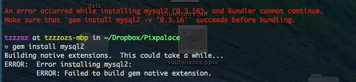



### Run test scripts

	$ tail -f log/development.log  	#Afficher les logs

	$ bundle exec rspec spec/requests/static_pages_spec.rb
	
	
###On OS X to start/stop/restart MySQL from the command line:

	$ sudo /usr/local/mysql/support-files/mysql.server start
	$ sudo /usr/local/mysql/support-files/mysql.server stop
	$ sudo /usr/local/mysql/support-files/mysql.server restart
	

Login mysql from the command line:
	
	$ /usr/local/mysql/bin/mysql -uroot
	

Some commands in mysql

	> show columns from light_boxes;
	$ /usr/local/mysql/bin/mysql -uroot -Dv2_production < ~/Documents/pixmysql/140604_maj_tpgn.sql		
	
	

---
###Mysql2::Error
#### Error installing mysql2
ErrorInfo:

	Building native extensions.  This could take a while...
	ERROR:  Error installing mysql2:
		ERROR: Failed to build gem native extension.
		

**Solution**

	$ brew install mysql
	$ gem install mysql2
	
#### Mysql2::Error: Incorrect string value
ErrorInfo:

	Mysql2::Error: Incorrect string value: '\xC5\x99\xC3\xA1k 
	
**Solution:**

The problem is caused by charset of your mysql server side. You can config manually like:

	> ALTER TABLE your_database_name.your_table CONVERT TO CHARACTER SET utf8
or drop the table and recreate it like:

	$ rake db:drop
	$ rake db:create
	$ rake db:migrate
	
references:

http://stackoverflow.com/a/18498210/2034097

http://stackoverflow.com/a/16934647/2034097

UPDATE

The first command only affect specified table, if you want to change all the tables in a database, you can do like

	> ALTER DATABASE databasename CHARACTER SET utf8 COLLATE utf8_general_ci;
reference:

http://stackoverflow.com/a/6115705/2034097

---
### Start/Stop the media processor

	$ tools/media_processor/bin/media_processor stop
	$ tools/file_processor/bin/file_processor stop
	
	$ tools/media_processor/bin/media_processor start
	$ tools/file_processor/bin/file_processor start
	
	$ ps -ef|grep media	
---
### Index/Start ts(sphinx seach engine)

	$ rake ts:start
	
	
---

### Follow the real-time log, with option -f

	$ tail -f log/media_processor.log
	
	
---

### Problem of "ERROR WEBrick::HTTPStatus::RequestURITooLarge"

*Because webrick does limit its max length of the URI request eval 2083 by default*

	$ vim ~/.rvm/rubies/ruby-x.x.x/lib/ruby/x.x.x/webrick/httprequest.rb
	
Look for the key word "RequestURITooLarge", you will find the following,

	 # MAX_URI_LENGTH = 2083
    MAX_URI_LENGTH = 64 * 1024 * 1024

    def read_request_line(socket)
      @request_line = read_line(socket
	 ...
Set the length to a larger number, you will fix the issue.